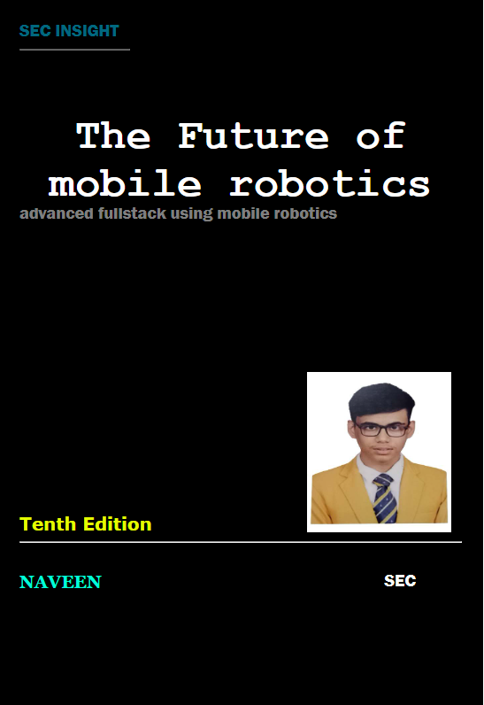

# Ex-08-Book-Cover-Design
# AIM:
To develop a website to display the cover page design of a book

# Design Steps:
# Step 1:
Create a new Django project and app.

# Step 2:
Create a static file directory and mention the changes in settings.

# Step 3:
Make a new folder templates inside your app and create a html and map them using views and url.

# Step 4:
Write down the code for book cover using HTML and CSS.

# Step 5:
Add images and other contents using CSS record a screenshot of it.

# PROGRAM
```
<!DOCTYPE html>
<html lang="en">
    <head>
        <meta name="viewport"
        content="width=device-width,initial-scale=1.0">
        <style>
        
            .bookpage {
                width: 400px;
                height: 600px;
                color: white; /* Change text color to make it visible on the background */
                margin-left: auto;
                margin-right: auto;
                padding: 20px;
                font-family: 'Franklin Gothic Medium', 'Arial Narrow', Arial, sans-serif;
                background-color: black;
                background-size: cover;
                position: relative;
            }
            
            /* Add a pseudo-element to create an overlay on the background image */
            .bookpage::before {
                content: '';
                position: absolute;
                top: 0;
                left: 0;
                width: 100%;
                height: 100%;
                background: rgba(0, 0, 0, 0.5); /* Adjust the opacity as needed */
            }
            
    

        .insight{
            color: hwb(191 0% 0%);

        }

        .hrstyle{
            width: 100px;
        }

        .author{
            color: white;
            display: inline;
            position: relative;
            color: #00ffd9;
            top: 190px;

            font-family: Georgia, 'Times New Roman', Times, serif;
            font-size: medium;
        }
        .booktitle{
            font-family: 'Courier New', Courier, monospace;
            font-size: larger;
            text-align: center;
            position: relative;
            top: 30px;
        }

        .id{
            width: 400px;
            position: relative;
            top: 180px;

        }

        .pub{
            font-size: medium;
            position: relative;
            top: 155px;
            left: 330px;
        }
        .ed{
            color: rgb(229, 255, 0);
            font-size: medium;
            font-family: Verdana, Geneva, Tahoma, sans-serif;
            position: relative;
            top: 85px;

        }
        .subtile{
            font-family: Tahoma;
            font-size: large;
            position: relative;
            top: 40px;
        }
        .mypic{
            position: relative;
            top: 135px;
            left: 260px;
            width: 100px;
            height: 100px;
            background-size: cover;
        }
        </style>
        <title>Book Cover Page</title>
    </head>
    <body>
        <div class="bookpage">
            <div class="insight">
                SEC INSIGHT
            </div>
            <div class="hrstyle">
                <hr style="color: rgb(170, 255, 0);">
            </div>
            <div class="booktitle">
                <h1>The Future of mobile robotics</h1>
            </div>
            <div class="subtitle">
            advanced fullstack using mobile robotics
            </div>
            <div class="mypic">
                
            </div>
            <div class="id">
                <hr style="color: orange;">
            </div>
            <div class="author">
                <p><b>NAVEEN</b></p>
            </div>
            <div class="pub">
                SEC
            </div>
            <div class="ed">
                <b>Tenth Edition</b>
            </div>
        </div>
    </body>
</html>
```

# OUTPUT:


# RESULT:
Thus the Book cover program is executed successfully.
